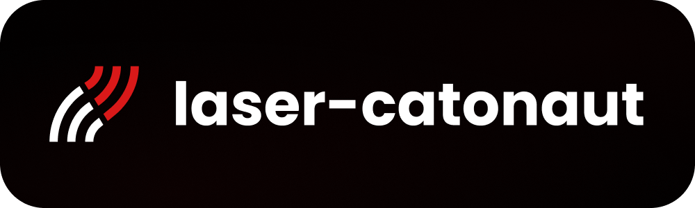

# Laser Catonaut

## Repository contents

Repository contains Laser Catonaut game made for the Żegluga GameJam Contest using React.

Project is using tools in versions listed below:

| Technology | Version |
| ---------- | ------- |
| Node.js    | ^24.x   |
| TypeScript | ^5.9    |
| Yarn       | ^1.22   |

Project's main dependencies are listed below.

| Dependency   | Version |
| -------      | ------- |
| Vite         | ^7.2    |
| React        | ^19.x   |
| Tailwind CSS | ^4.x    |
| Vitest       | ^4.x    |
| Playwright   | ^1.x    |
| Storybook    | ^10.x   |
| Phaser       | ^3.9    |

### Package descriptions

- **Vite** - Next-generation frontend build tool providing fast development experience with instant HMR and optimized production builds
- **React** - JavaScript library for building user interfaces
- **Tailwind CSS** - Utility-first CSS framework for rapid UI development
- **Vitest** - Fast unit testing framework powered by Vite
- **Playwright** - End-to-end testing framework for reliable cross-browser testing
- **Storybook** - UI development environment and playground for building, previewing, and testing isolated components interactively
- **Phaser** - JavaScript game framework

## Infrastructure

This is a frontend-only project that runs locally using Vite development server.

## Setting project up

This app uses Node.js and Yarn package manager. In order to set up project, follow these steps:

1. Install Node.js (v24.x or higher):
   - Download from [nodejs.org](https://nodejs.org/)
   - Use a version manager like [nvm](https://github.com/nvm-sh/nvm)

2. Install Yarn globally:

   ```shell
   npm install --global yarn@^1.22
   ```

3. Clone project by running:

   ```shell
   git clone <your-repository-url>
   ```

4. Navigate to the project directory:

   ```shell
   cd laser-catonaut
   ```

5. Install dependencies using Yarn:

   ```shell
   yarn install
   ```

## Running the project

To start the development server:

```bash
yarn dev
```

Open [http://localhost:5173](http://localhost:5173) with your browser to see the result.

## Available scripts

```bash
yarn dev              # Start development server
yarn build            # Build for production
yarn preview          # Start production server (after build)
yarn test             # Run unit tests with Vitest
yarn test:coverage    # Run tests with coverage report
yarn lint             # Run Biome linter
yarn lint:fix         # Fix linting issues automatically
yarn storybook        # Run Storybook in development mode
yarn storybook:build  # Build Storybook for production
```

## Build

This project uses Vite and React Router for building and serving the application. The build process generates optimized static assets for production deployment.

Build the project with `yarn build` and preview the production build locally with `yarn preview`.

## Testing

This project includes both unit testing and end-to-end testing:

- **Unit Tests**: Uses Vitest with React Testing Library for component and utility testing

Run tests with:

```bash
yarn test              # Run unit tests
yarn test:coverage     # Run tests with coverage
```

## Linting

This project uses BiomeJS for code linting and formatting. Biome is a fast, all-in-one toolchain that replaces ESLint, Prettier, and other tools.

- **Linter**: BiomeJS provides fast linting with TypeScript support
- **Formatter**: Built-in code formatter with consistent style
- **Import Organization**: Automatic import sorting and organization

Run linting with:

```bash
yarn lint              # Check for linting issues
yarn lint:fix          # Automatically fix linting and formatting issues
```

The project is configured with custom linting rules in `biome.json`, including complexity checks, style rules, and correctness validations for TypeScript files.

## Resources

- [Vite Documentation](https://vite.dev/) - Vite build tool documentation
- [React Router Documentation](https://reactrouter.com/) - React Router framework documentation
- [React Documentation](https://react.dev/reference/react) - React.js reference
- [Learn React](https://react.dev/learn) - an interactive React.js tutorial
- [Tailwind CSS Documentation](https://tailwindcss.com/) - Tailwind CSS documentation
- [Vitest Documentation](https://vitest.dev/) - Vitest testing framework documentation
- [BiomeJS Documentation](https://biomejs.dev/) - BiomeJS linter and formatter documentation
- [Storybook Documentation](https://storybook.js.org/) - Storybook component development and visual testing documentation
- [Phaser Documentation](https://docs.phaser.io/phaser/) - Game framework documentation
